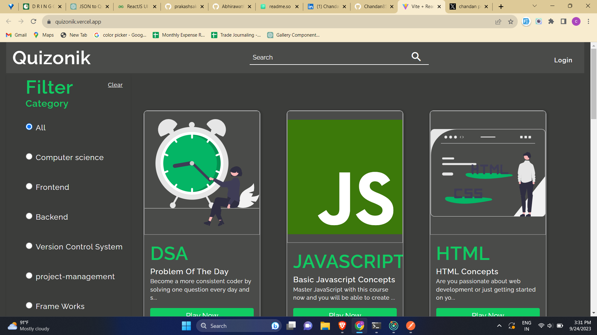

# Quizonik

Quizonik is a quiz app with multiple choice questions from various
categories such as frontend, javascript, backend etc. Whether you're a trivia enthusiast or just looking to challenge yourself, Quizonik has got you covered.


## Features

- On the homepage, you'll find a diverse selection of quiz categories. You can also use the filter section and search option to easily locate the quiz that piques your interest.
- Each quiz consists of 10 thought-provoking questions. You have a single attempt to answer each question correctly. If your answer is right, the selected option will turn green; otherwise, it will be marked in red.

- Once you've completed a quiz, the results page will reveal your score. You can review all the questions you attempted, including both correct and incorrect answers.
- Access to gameplay requires user authentication. You can log in using any dummy ID and password—no need to worry about creating a real account.
- If you're new to the platform, you can easily create a new account through the signup page. It's a straightforward process to get you started on your quiz journey.


## Tech Stack

**Client:** React, React-Context API, Html, CSS

**Server:** Node, Express , MongoDB


## Author

- Chandan Pratap
- [github](https://github.com/Chandan8585)
- [LinkedIn](https://www.linkedin.com/in/chandan-pratap-464386154/)
- [Twitter](https://twitter.com/chandanpra25704)


# Live Link
# Frontend Link

https://quizonik.vercel.app/

# Backend Link

https://wicked-plum-sea-urchin.cyclic.cloud


## Running the App Locally
To get started with this project on your local machine, follow these simple steps:

- Clone the project using the following command in your terminal. Ensure that you have Git installed and added to your system's path.

```bash
  git clone git@github.com:Chandan8585/FE_QuizApp.git
```

- Navigate to the project directory:
```bash
  cd quizonik
```
- Install the required dependencies:
```bash
  npm install
```
- Start the server:
```bash
  npm run dev
```

# Demo
## Screenshot
.png)
.png)

.png)
.png)


# Video Demo
<video src="./src/assets/Screen_recording-2023-09-24_19-10-31.mp4" controls="controls" alt="video"></video>

